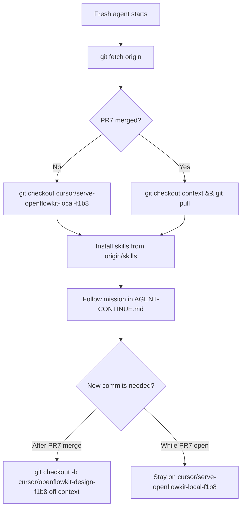

# Agent continuation prompt — et2 OpenFlowKit / system design

> **Copy everything below the line into a fresh agent chat** to continue architecture and OpenFlowKit work on this repo.

---

## Handoff pointer

1. If present, read **`/tmp/et2-architecture-local-handoff.md`** for the latest session notes from the prior agent.
2. Otherwise use this file plus [`architecture/README.md`](README.md) and [`CONTEXT.md`](../CONTEXT.md).
3. Open PR context: [#7 — Serve et2 architecture diagrams on localhost](https://github.com/flowtress-docker/et2/pull/7).

Optional mirror (temp handoffs only): `/tmp/et2-architecture-continue-prompt.md` — **repo file is source of truth**.

---

## Branch workflow

### Decision tree



### Branches

| Role | Branch | Action |
|------|--------|--------|
| **Work branch (now)** | `cursor/serve-openflowkit-local-f1b8` | Checkout, continue [PR #7](https://github.com/flowtress-docker/et2/pull/7) |
| **Merge target** | `context` | PR base; switch here after merge |
| **Skills (read-only)** | `origin/skills` | Worktree + `./scripts/install-skills.sh <worktree>` — do **not** commit skills work on architecture branch |
| **New work after merge** | `cursor/<descriptive-name>-f1b8` | Branch off `context` per cloud-agent rules |

### Bootstrap (copy-paste)

```bash
git fetch origin context skills cursor/serve-openflowkit-local-f1b8
git checkout cursor/serve-openflowkit-local-f1b8
git pull origin cursor/serve-openflowkit-local-f1b8

# Skills (once per worktree)
git worktree add ../et2-skills origin/skills 2>/dev/null || true
../et2-skills/scripts/install-skills.sh "$(pwd)"
```

---

## Canonical sources

| Source | Path | Role |
|--------|------|------|
| Architecture spec (YAML) | [`staging/v2/docs/grill-me_sesh/architecture.yaml`](../staging/v2/docs/grill-me_sesh/architecture.yaml) | Canonical structured spec — layers, flows, anti-patterns |
| OpenFlow DSL diagrams | [`architecture/*.ofk`](.) | Visual mirror of YAML; edit here for OpenFlowKit |
| Domain glossary | [`CONTEXT.md`](../CONTEXT.md) | Terms, plugin model, live sim semantics |
| Viewer URL index | [`architecture/viewer-urls.json`](viewer-urls.json) | Cloud `#/view` links per diagram |
| Agent OpenFlowKit notes | [`architecture/openflowkit.md`](openflowkit.md) | MCP workflow, local dev URLs |

**YAML ↔ OFK mapping:**

| `.ofk` file | `architecture.yaml` section |
|-------------|-------------------------------|
| `et2-system-layers.ofk` | `layers[]` |
| `et2-install-flow.ofk` | `flows.install` |
| `et2-create-simulation.ofk` | `flows.create_simulation` |
| `et2-live-session.ofk` | `flows.live_interaction` |
| `et2-session-end.ofk` | `flows.session_end` |
| `et2-anti-patterns.ofk` | `anti_patterns[]` |

---

## Known constraints

1. **Mermaid gallery is the primary local viewer** — fast, edges render correctly.
   - `./scripts/serve-architecture-local.sh` → http://127.0.0.1:8765/gallery-mermaid.html
2. **OpenFlowKit `#/view` has an upstream edge bug** — React Flow nodes lack connection handles (`target handle id: "top"`). Nodes render; connectors fail. Not a load-time or runtime issue.
3. **Bun does not fix the viewer** — rendering is in-browser React + ELK. Keep OpenFlowKit serve script for **Open in Editor** only.
4. **Marketing site ≠ app** — use `app.openflowkit.com/#/view?…`, not `openflowkit.com/view?…`.
5. **Do not change diagram content or scripts in doc-only tasks** unless the mission explicitly requires it.

---

## Mission priorities

Work in this order unless the operator redirects:

1. **Land PR #7** — review, address feedback, merge into `context` when ready.
2. **YAML ↔ OFK pipeline** — keep `.ofk` files in sync with `architecture.yaml`; regenerate viewer URLs after edits.
3. **Diagram quality** — improve layout, labels, and Mermaid conversion fidelity (`scripts/ofk-to-mermaid.mjs`).
4. **Optional upstream issue** — file or link an OpenFlowKit issue for the `#/view` handle/edge bug (flowtress-docker or Vrun-design fork).

Out of scope unless asked: plugin MCP implementation, Wokwi sim code, skills branch changes.

---

## Skills (from `origin/skills`)

Install once per worktree (see bootstrap). **Read-only** — commit skill updates on `skills` branch only.

| Skill | Path on `origin/skills` | Use for |
|-------|-------------------------|---------|
| `caveman` | `.cursor/skills/caveman/` | Terse communication (ultra default via rule) |
| `caveman-commit` | `.cursor/skills/caveman-commit/` | Conventional Commits, compressed |
| `caveman-review` | `.cursor/skills/caveman-review/` | One-line PR review comments |
| `caveman-compress` | `.cursor/skills/caveman-compress/` | Compress markdown context docs |
| `handoff` | `.cursor/skills/handoff/` | Session handoff for next agent |
| `grill-with-docs` | `.cursor/skills/grill-with-docs/` | Doc-driven design review (ADR/CONTEXT formats) |
| `tdd` | `.cursor/skills/tdd/` | TDD workflow when implementing code |

Default rule: `.cursor/rules/caveman-ultra-default.mdc` (`alwaysApply: true`).

Compress context docs (no API key):

```bash
./scripts/compress-context-docs.sh
```

---

## Success criteria

- [ ] PR #7 merged to `context` (or clearly blocked with documented reason)
- [ ] `architecture.yaml` and `architecture/*.ofk` stay aligned
- [ ] Mermaid gallery loads all six diagrams with visible edges
- [ ] `viewer-urls.json` matches current `.ofk` content after any diagram edit
- [ ] Agent continuation workflow documented in this file (no chat-only handoffs)

---

## Verify commands

```bash
# Fast gallery (primary)
./scripts/serve-architecture-local.sh
# → http://127.0.0.1:8765/gallery-mermaid.html

# Regenerate Mermaid HTML from .ofk
node scripts/generate-mermaid-gallery.mjs architecture

# Regenerate cloud viewer URLs (after .ofk edits)
cd scripts && npm install && node encode-openflow-viewer-url.mjs ../architecture

# Optional OpenFlowKit editor (slow; edges broken in #/view)
./scripts/serve-openflowkit-local.sh
# → http://127.0.0.1:5173/et2-gallery.html
```

---

## PR / refs

| Item | Value |
|------|-------|
| **Open PR** | [#7 — Serve et2 architecture diagrams on localhost](https://github.com/flowtress-docker/et2/pull/7) |
| **Feature branch** | `cursor/serve-openflowkit-local-f1b8` (`origin/cursor/serve-openflowkit-local-f1b8`) |
| **Merge target** | `context` (`origin/context`) |
| **Skills branch** | `skills` (`origin/skills`) |
| **OpenFlowKit upstream** | [flowtress-docker/openflowkit](https://github.com/flowtress-docker/openflowkit) |
| **OpenFlowKit app** | [app.openflowkit.com](https://app.openflowkit.com) |
