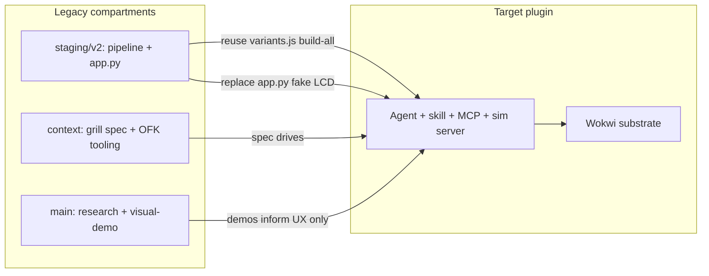

# Migration + topology diagram pair

## Problem

`[architecture/et2-system-layers.ofk](architecture/et2-system-layers.ofk)` mixes **deployment** (install), **runtime** (MCP/simsrv), and **build pipeline** (variants/toolchain) in one “layers” stack. `[staging/v2/docs/grill-me_sesh/status-matrix.yaml](staging/v2/docs/grill-me_sesh/status-matrix.yaml)` documents current→target gaps but has no visual. Legacy assets live on different branches and are invisible in diagrams.

## Approach

Two new canonical views + retire the old layers diagram:


| Diagram                     | File                                   | Purpose                                                                               |
| --------------------------- | -------------------------------------- | ------------------------------------------------------------------------------------- |
| **Target runtime topology** | `architecture/et2-target-topology.ofk` | Steady-state plugin deployment only (no install script, no build steps)               |
| **Branch migration path**   | `architecture/et2-migration-path.ofk`  | Compartments from `main` / `staging/v2` / `context` → target; reuse/replace/new edges |


Default decisions (no blockers): **replace** `et2-system-layers.ofk`; add `**compartments.yaml`** as canonical compartment source.




---

## 1. Canonical YAML: `compartments.yaml`

Add `[staging/v2/docs/grill-me_sesh/compartments.yaml](staging/v2/docs/grill-me_sesh/compartments.yaml)` — source of truth for branch compartments and migration edges.

**Structure:**

```yaml
compartments:
  - id: main_research
    branch: main
    assets: [research/, visual-demo/, run-demo.sh]
    role: Pre-product exploration; PNG gallery UX reference

  - id: staging_pipeline
    branch: staging/v2
    assets: [staging/v2/scripts/variants.js, build-all.js, templates/base/]
    role: Script-driven variant generation (current delivery)

  - id: staging_legacy_sim
    branch: staging/v2
    assets: [app.py, static/index.html]
    role: Manual Flask sim; fake LCD anti-pattern

  - id: context_spec
    branch: context
    assets: [staging/v2/docs/grill-me_sesh/*, architecture/*.ofk]
    role: Grill spec + diagram mirror (not runtime)

  - id: target_plugin
    branch: "(not built)"
    assets: [install-plugin.sh, MCP package, et2 skill, .et2/projects/]
    role: Target product surface

migration:
  - from: staging_pipeline
    to: target_plugin
    action: reuse
    maps: { variants.js: variant_engine, build-all.js: toolchain_preflight }

  - from: staging_legacy_sim
    to: target_plugin
    action: replace
    note: Session-scoped sim server; remove fake LCD

  - from: context_spec
    to: target_plugin
    action: implement
    note: architecture.yaml is build spec

  - from: main_research
    to: target_plugin
    action: inform
    note: visual-demo UX only; not reused as code
```

Register in `[manifest.yaml](staging/v2/docs/grill-me_sesh/manifest.yaml)` and cross-link from `[implementation-map.yaml](staging/v2/docs/grill-me_sesh/implementation-map.yaml)` (each `reuse` row gets a `compartment:` id).

Light touch `[architecture.yaml](staging/v2/docs/grill-me_sesh/architecture.yaml)`: add `views:` block pointing to topology + migration `.ofk` files (keep existing `layers[]` for glossary compatibility).

---

## 2. `et2-target-topology.ofk` (replaces system-layers)

**Rename + rewrite** `[architecture/et2-system-layers.ofk](architecture/et2-system-layers.ofk)` → `et2-target-topology.ofk`.

Key fixes from adversarial review:

- Remove `install-plugin.sh` (belongs in install flow only)
- Split actor clarity: Operator → Agent+skill → MCP
- MCP → variant engine + sim server (parallel, not serial god-box)
- Sim server → embed **or** daemon fork (two edges, label on fallback)
- Toolchain invoked by MCP/variants, not peer layer above Wokwi
- Add `operator -> simsrv` edge (localhost canvas URL)
- Consistent node types: `[browser]` operator, `[system]` agent/mcp/simsrv/daemon, `[architecture]` wokwi/embed only

Sketch:

```
flow: et2 Target runtime topology
direction: TB

[browser] operator: Operator
[system] agent: Agent + et2 skill
[system] mcp: MCP server
[process] variants: Variant engine
[process] toolchain: PlatformIO + wokwi-cli
[system] simsrv: Local sim server
[architecture] embed: Wokwi embed
[system] daemon: wokwi-cli daemon
[architecture] wokwi: Wokwi substrate

operator ==> agent
agent ==> mcp
mcp ==> variants
mcp ==> simsrv
variants ==> toolchain
toolchain ==> wokwi
simsrv ==> embed
simsrv -> daemon
embed ==> wokwi
daemon ==> wokwi
operator -> simsrv
```

Delete `et2-system-layers.ofk`; grep-replace all references (`README`, `AGENT-CONTINUE`, `CONTEXT.md`, cloud link anchor).

---

## 3. `et2-migration-path.ofk` (new)

Branch compartments as **hub nodes** with prefixed child assets (OFK has no native `group` syntax per [OpenFlow DSL docs](https://docs.openflowkit.com/openflow-dsl/)).

**Node ID convention:** `{compartment}__{asset}` — enables Mermaid subgraph grouping in converter.

Example nodes:

```
[system] main__hub: "main branch"
[process] main__visual_demo: visual-demo gallery
[system] staging__hub: "staging/v2 branch"
[process] staging__variants: variants.js + build-all
[process] staging__app_py: app.py + static fake LCD
[system] context__hub: "context branch"
[process] context__spec: grill-me spec + OFK
[system] target__hub: "Target plugin"
[system] target__mcp: MCP + skill + install
[system] target__sim: Session sim server
[architecture] target__wokwi: Wokwi substrate
```

**Migration edges** (from `compartments.yaml`): reuse (solid `==>`), replace (dashed `--` if OFK supports, else labeled `->|replace|`), inform (dotted `..` per DSL docs).

Annotate anti-pattern on `staging__app_py -> target__sim` with label `no fake LCD`.

---

## 4. Pipeline: Mermaid subgraph support

Extend `[scripts/ofk-to-mermaid.mjs](scripts/ofk-to-mermaid.mjs)`:

- Detect node ids matching `^(\w+)__` → group into `subgraph compartmentId ["Label"]`
- Hub nodes (`__hub`) render as compartment title or omitted from inner group
- Topology file (no `__`) unchanged

Update `[scripts/generate-mermaid-gallery.mjs](scripts/generate-mermaid-gallery.mjs)` nav: add **Target topology** + **Migration path**; remove **System layers**.

Regenerate:

```bash
node scripts/generate-mermaid-gallery.mjs architecture
cd scripts && node encode-openflow-viewer-url.mjs ../architecture
```

Commit updated `[architecture/viewer-urls.json](architecture/viewer-urls.json)` and generated `gallery-mermaid.html` / `diagrams/*.mmd`.

---

## 5. Doc updates


| File                                                               | Change                                                                            |
| ------------------------------------------------------------------ | --------------------------------------------------------------------------------- |
| `[architecture/README.md](architecture/README.md)`                 | Diagram table: topology + migration; remove system-layers; note compartment model |
| `[architecture/AGENT-CONTINUE.md](architecture/AGENT-CONTINUE.md)` | Canonical sources + YAML↔OFK mapping rows for new files                           |
| `[CONTEXT.md](CONTEXT.md)`                                         | Link “System layers” → “Target topology”                                          |
| `[architecture/openflowkit.md](architecture/openflowkit.md)`       | Disambiguate “OpenFlowKit MCP (diagrams)” vs “et2 MCP (plugin)”                   |


**Out of scope for this pass** (defer unless you want bundled): actor fixes to `[et2-create-simulation.ofk](architecture/et2-create-simulation.ofk)` and `[et2-live-session.ofk](architecture/et2-live-session.ofk)` — topology diagram captures the corrected model; flow diagrams can follow in a second PR.

---

## 6. Verification

```bash
./scripts/serve-architecture-local.sh
# http://127.0.0.1:8765/gallery-mermaid.html#et2-target-topology
# http://127.0.0.1:8765/gallery-mermaid.html#et2-migration-path
```

Manual checks:

- Migration diagram shows 4 legacy compartments + target with labeled reuse/replace/inform edges
- Topology has no install node; hybrid sim fork visible
- Gallery nav lists 7 diagrams (was 6; -1 layers +2 new)
- No stale `et2-system-layers` references in repo

---

## Branch / PR

Work on `[cursor/serve-openflowkit-local-f1b8](https://github.com/flowtress-docker/et2/tree/cursor/serve-openflowkit-local-f1b8)`; update [PR #7](https://github.com/flowtress-docker/et2/pull/7).
